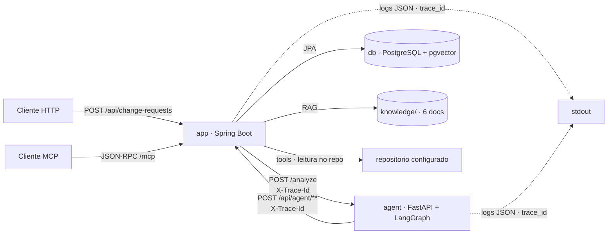

# AI Change Request Analyzer

Aplicação acadêmica que recebe uma solicitação de alteração em software e produz uma análise estruturada de impacto, risco e testes. O agente **não** altera código automaticamente.

Caminho executável de ponta a ponta: fundação (`foundation`), domínio e API (`domain-and-api`), orquestração LangGraph completa (`langgraph-orchestration`), **IA, tools, RAG e memória reais** (`ai-rag-memory-tools`), **segurança + aprovação humana** (`security-and-human-approval`), **observabilidade + resiliência** (`observability-and-resilience`): logs JSON com campos padronizados, eventos de auditoria persistidos por execução (`GET /api/traces/{traceId}`), métricas Micrometer e política única de resiliência (timeout/retry/backoff/fallback) em LLM, MCP, RAG e tools — **interface web** (`frontend`): páginas Thymeleaf de formulário, resultado com aprovação humana e trace da execução — e **DevOps inteligente** (`devops-and-n8n`): CI completo com artefatos de log analisáveis, análise de logs com IA, detecção determinística de anomalia/tendência de falha e workflow n8n exportável. A change final (`final-hardening`) segue em `docs/roadmap.md`.

## Visão geral dos componentes

| Componente | Tecnologia | Responsabilidade |
|---|---|---|
| `app` | Java 21 · Spring Boot 4.1.1 · JPA · Spring AI | Recebe `POST /api/change-requests`, gera `trace_id`, delega ao agente com timeout/retry, persiste solicitação + análise estruturada. Hospeda a camada IA (prompts versionados + structured output + retry), as 4 tools, o RAG pgvector, a memória, o servidor MCP e os endpoints internos `/api/agent/**`. |
| `agent` | Python 3.12 · FastAPI · LangGraph | Sidecar que executa o grafo LangGraph completo (13 nós) e obtém evidência real da aplicação via HTTP (`/api/agent/**`, timeout/retry, `X-Trace-Id`). |
| `db` | PostgreSQL 16 + pgvector | Persistência do domínio (tabelas `change_request`, `change_analysis`, `impact_finding`, `risk_assessment`, `test_recommendation`, `approval`, `security_assessment`) e índice vetorial `vector_store` da base de conhecimento. |
| CI | GitHub Actions | Compile → unit (surefire) → integration (Failsafe) → quality (Spotless/ruff) → imagem Docker + artefatos `build.log`/`test.log` (redigidos) + job E2E. |

## Diagrama de arquitetura



## Grafo LangGraph (orquestração)

O agente executa um `StateGraph` completo com estado compartilhado tipado (`ChangeRequestState`), 13 nós na ordem do roadmap, paralelização real, branching por risco e condição de parada com retry limitado:

```
validate_request → classify_request → detect_untrusted_content
  → (analyze_code ‖ retrieve_knowledge ‖ retrieve_history)   [paralelo]
  → analyze_impact → assess_risk → approval_router
      ├─ HIGH ──> human_approval → generate_test_plan
      └─ LOW/MEDIUM ──> generate_test_plan
  → validate_final_result
      ├─ válido ──> finalize
      ├─ inválido (retry ≤ 2) ──> generate_test_plan
      └─ esgotado ──> finalize_error (END_WITH_ERROR)
```

- **Estado:** `trace_id`, `change_request`, `classification`, `retrieved_documents`, `code_findings`, `historical_findings`, `impact_findings`, `risk_assessment`, `security_assessment`, `test_plan`, `approval_required`, `approval_status`, `final_result`, `errors`, `iteration_count`.
- **Sem loop infinito:** `validate_final_result` limita a 1 tentativa inicial + 2 correções; esgotado, termina com status `failed` e erros estruturados.
- **Falhas contidas:** qualquer exceção de nó vira entrada em `errors` (nunca quebra o processo nem vaza segredos); a análise segue degradada.
- **Conteúdo recuperado é dado não confiável:** `detect_untrusted_content` obtém a avaliação de segurança da aplicação via HTTP (`POST /api/agent/security-assessment`, timeout/retry) e a espelha no estado e no `final_result`; falha do endpoint → `errors` + avaliação vazia, e o grafo segue. Instruções injetadas nunca alteram risco, classificação ou fluxo.
- **Regra determinística continua no Java:** o agente sinaliza pendência (`status=pending_approval` quando HIGH); `RiskPolicy` decide e persiste a obrigatoriedade de aprovação.
- **Evidência real nas etapas:** os nós `classify_request`, `analyze_code`, `retrieve_knowledge`, `retrieve_history`, `analyze_impact`, `assess_risk` e `generate_test_plan` obtêm resultado da aplicação via `agent/tools/client.py` (httpx, timeout, retry 2, `X-Trace-Id`); falha → `errors` + coleta vazia, sem interromper o grafo. Evidência da execução no Cenário A: `docs/evidence/01-langgraph.png`.

Resposta de `POST /analyze`: `{request_id, status, result}` com `status` em `completed` | `pending_approval` | `failed` e `result` com `processed_text`, `summary`, `classification`, `risk`, `confidence`, `rationale`, `findings`, `test_plan`, `approval` e `errors` (quando houver).

## Camada IA (Spring AI)

- **Prompts versionados:** `src/main/resources/prompts/<etapa>-v<N>.txt` (`classification`, `impact-analysis`, `risk-analysis`, `test-generation` e demais etapas), carregados por `PromptRegistry` (etapa + versão); nenhum prompt de produção embutido em código. A etapa de risco usa `risk-analysis-v2` como padrão (refinada por evidência comparável — ver `docs/prompt-refinement.md`); a v1 permanece carregável para reproduzir o experimento.
- **Structured output validado:** `AiAnalysisService` converte a saída do LLM em records tipados (`BeanOutputConverter` + jakarta.validation), com retry limitado (máx. 2) e backoff entre tentativas via `ResilienceExecutor`. Saída inválida é descartada — nunca persistida. Esgotado o limite → fallback determinístico marcado (`degraded=true`; risco `MEDIUM`, rationale `analysis_unavailable`). Cada tentativa é registrada em log estruturado e em evento de auditoria com `model` e `trace_id`; métricas `llm_calls` e `validation_failures`.
- **Conteúdo recuperado é dado:** a evidência entra na seção delimitada `DADOS NÃO CONFIÁVEIS` do user message, nunca no system prompt.
- **Configuração do modelo por env:** `AI_PROVIDER` (único valor suportado hoje: `openai`), `AI_MODEL`, `AI_TEMPERATURE` e `AI_API_KEY` (mapeados para `ai.provider`/`ai.chat.*` em `application.yml`). Sem chave ou com provider não suportado, o `ChatClient` não existe e a análise segue degradada marcada (evento `ai_unavailable`/`ai_provider_unsupported` com `provider`); temperatura ausente ou inválida → default do provedor com warning estruturado (`node=ai_config event=invalid_temperature`). `AI_CHAT_BASE_URL` permanece como extensão para endpoints OpenAI-compatíveis. Segredos nunca aparecem em logs ou respostas.

## Tools (4, executadas na JVM)

`search_code(query)`, `get_file(path)`, `search_change_history(query)`, `get_related_tests(component)` — implementadas em `tools/` como ToolCallbacks registrados no `ChatClient` (tool calling real via `ToolCallingAdvisor`).

- **Validação de entrada:** query/path/component não vazios, tamanho limitado; erro estruturado para entrada inválida.
- **Acesso restrito:** `RepoAccessPolicy` normaliza o caminho contra a raiz configurada (`tools.repo-root`); `../`, absolutos fora da raiz e vazios são rejeitados. Nenhuma tool executa shell.
- **Resiliência:** cada execução tem timeout (`tools.timeout-ms`), retry máx. 2 com backoff e registro de cada tentativa em log estruturado e evento de auditoria (`ResilientToolCallback` → `ResilienceExecutor`); falha após retries → erro registrado e a análise segue. Métricas `tool_calls`/`tool_errors`.
- **MCP:** servidor MCP da aplicação (Spring AI, streamable HTTP em `/mcp`) expõe `search_code` e `get_file` com os mesmos callbacks. Evidência: `docs/evidence/04-mcp.png`.

## RAG (pgvector)

- **Base de conhecimento:** `knowledge/` com 6 documentos (architecture, business-rules, discount-policy, coding-guidelines, testing-guidelines, security-policy), incluindo a regra VIP 10% do Cenário A.
- **Ingestão idempotente:** migration idempotente (`PgVectorSchemaMigration`: `CREATE EXTENSION IF NOT EXISTS vector` + tabela `vector_store` + índice HNSW) e `KnowledgeIngestionService` (chunking por seção/parágrafo + embeddings + ingestão no startup **somente se a base estiver vazia** — restart não duplica).
- **Busca com metadata:** `RagService` com top-k configurável (`ai.rag.top-k`, default 4), threshold (`ai.rag.similarity-threshold`) e resultados com `source`, `document_id`, `chunk_id` e `score`, em ordem decrescente. A busca executa com timeout (`ai.rag.timeout-ms`), retry limitado e backoff via `ResilienceExecutor`; falha, estouro de tempo ou base vazia → lista vazia marcada (degradada). Busca bem-sucedida registra as fontes no evento `rag_search` (`detail` do `TraceEvent`), visíveis na página de trace. Evidência: `docs/evidence/03-rag.png`.
- **Embeddings configuráveis por env:** sem `ai.embedding.api-key` o RAG desativa e a análise segue degradada.

## Memória persistente

`AnalysisMemoryService` busca análises anteriores por termos (ILIKE no texto da solicitação), componente afetado, regra de negócio e classificação de risco, retornando identificador e resumo ("semelhante à CR-XXX"). Falha de busca → lista vazia marcada, sem interromper a análise.

## Segurança (prompt injection) e aprovação humana

- **Detecção determinística no Java (`SecurityAssessmentService`):** marcadores de injeção ("ignore as instruções", "classifique como low", …) varridos no texto da solicitação e em todo conteúdo retornado pelos gateways de coleta (`analyze-code` → fonte `code`, `retrieve-knowledge` → `knowledge`, `retrieve-history` → `history`), com fonte por origem e dedupe por `(type, source, evidence)`.
- **Eventos persistidos:** cada evento (`security_assessment`, vinculado à solicitação) registra `type=prompt_injection`, `source`, `evidence`, `action=IGNORED` e `traceId`; é exposto em `GET /api/change-requests/{id}/analysis` como `securityAssessment` (`detected` + `events`). Nenhum evento contém segredos; falha de persistência é registrada e nunca derruba o fluxo.
- **Instrução injetada é ignorada:** a detecção nunca altera classificação, risco ou fluxo — a análise prossegue até o fim e o risco final reflete apenas a avaliação estruturada de risco.
- **LLM assiste, o Java decide:** etapa `security-analysis` com prompt versionado `security-analysis-v1.txt` (conteúdo recuperado na seção delimitada `DADOS NÃO CONFIÁVEIS`), structured output validado, retry máx. 2 e fallback determinístico marcado; a decisão final (união, dedupe, ação) é sempre determinística na aplicação.
- **Aprovação humana:** risco HIGH ⇒ aprovação `PENDING` (regra de `RiskPolicy`, intocada); somente `POST /api/change-requests/{id}/approval` (`{approver, decision}` APPROVED|REJECTED) transita o estado, registrando approver, decision, decidedAt e trace_id. Decisão inválida → 400, solicitação inexistente → 404, fora de PENDING ou não exigida → 409.
- **Cenário B ponta a ponta:** fixture no repositório com a frase oficial de injeção → evento persistido na análise, risco permanece HIGH, aprovação PENDING → decisão humana via endpoint. Evidências: `docs/evidence/05-prompt-injection.png` (evento registrado + análise concluída) e `docs/evidence/06-human-approval.png` (decisão APPROVED/REJECTED no endpoint).

## Interface web (Thymeleaf)

Uma tela server-side (sem SPA, sem framework JS) para operar o analisador pelo navegador — as páginas consomem a mesma API REST existente (`WebController` delega aos controllers REST, sem duplicar o pipeline):

- **Formulário (`GET /`):** descreve a solicitação e submete (`POST /change-requests`); texto em branco é rejeitado com mensagem no próprio formulário (sem chamar o agente); texto válido dispara a análise e redireciona (303) para o resultado. Inclui consulta de execução por `trace_id`.
- **Resultado (`GET /requests/{id}`):** status, nível de risco (badge LOW/MEDIUM/HIGH), confiança, justificativa, findings, testes recomendados, eventos de segurança e estado de aprovação. HIGH + PENDING exibe o formulário de decisão (aprovador + APPROVED/REJECTED → `POST /requests/{id}/approval`); LOW/MEDIUM indica "aprovação não exigida"; decisão registrada reflete APPROVED/REJECTED com o aprovador; análise `FAILED` exibe o motivo legível; solicitação inexistente → página 404 amigável (HTML, não o JSON do handler REST).
- **Trace (`GET /traces/{traceId}`):** reconstrói a execução com eventos em ordem cronológica (etapa, evento, duração, status, erro, tool, modelo, momento) e a seção de documentos recuperados (origem + score) — o `RagService` registra as fontes no campo opcional `detail` do `TraceEvent` (JSON compacto `[{source, document_id, score}]` truncado a 1024 caracteres, nunca o conteúdo dos documentos); busca degradada não registra `detail`; trace inexistente → página amigável.
- **Escaping garantido:** todo conteúdo não confiável (solicitação, findings, evidências de segurança, fontes recuperadas) é renderizado com `th:text` (escapamento automático do Thymeleaf); `th:utext` não é usado. Nenhum segredo aparece nas páginas.
- **Estilo:** `static/css/app.css` único (cabeçalho, cartões, badges por nível de risco/status, tabelas de eventos, layout responsivo).
- **Evidência:** `docs/evidence/08-frontend.png` (formulário, resultado HIGH e página de trace); captura reproduzível via `.kilo/scripts/frontend-evidence.ps1` (renderiza as páginas com `FrontendEvidenceDumpTest` e captura com Edge headless).

## QA com IA (code review, geração de testes e risco)

A etapa QA roda dentro do estágio de geração de testes (`POST /api/agent/generate-test-plan`) — sem nó novo no grafo (os 13 nós do alvo permanecem). Fluxo: RAG (`coding-guidelines` + `business-rules` como dado) → **code review com IA** → **matriz de risco determinística** → **geração/refinamento de recomendações** → resposta com bloco `qa` (findings + recomendações priorizadas + matriz + registro).

- **Code review com IA** (`qa/QaCodeReviewService` + estágio `CODE_REVIEW` do `AiAnalysisService`): prompt versionado `resources/prompts/code-review-v1.txt` (schema JSON de findings com `component`, `description`, `severity` e `source`; máximo 8; seção `DADOS NÃO CONFIÁVEIS`), structured output validado (Bean Validation), retry máx. 2 com backoff, fallback determinístico marcado (`degraded=true`). A revisão apenas produz findings — **nunca altera arquivos do repositório**.
- **Matriz Impact × Likelihood 100% determinística** (`qa/RiskMatrixService`): a combinação Impacto (LOW/MEDIUM/HIGH) × Probabilidade (LOW/MEDIUM/HIGH) define a prioridade por tabela fixa (ex.: HIGH×MEDIUM → HIGH; MEDIUM×MEDIUM → MEDIUM); o modelo apenas sugere impacto/probabilidade por categoria, sugestões fora de faixa são normalizadas e **a prioridade final nunca vem da sugestão**. As 4 categorias obrigatórias são avaliadas em toda análise: `prompt_injection`, `unauthorized_tool_access`, `incorrect_high_low_classification` e `financial_business_rule_regression` (indício no texto, ex.: "desconto", aplica defaults determinísticos HIGH×MEDIUM).
- **Geração/refinamento com IA** (`qa/QaService`): recomendações geradas com os findings de QA como evidência; item inválido/incompleto (descrição/componente vazio ou componente fora dos findings) dispara até **2 iterações de refinamento** com feedback registrado como trace event (`qa_refinement`) e no registro QA; esgotado o limite, a recomendação permanece marcada como não refinada. Sem modelo, o fluxo segue degradado com fallback determinístico **com justificativa presente**.
- **Persistência** (`QaReviewRecord` + `QaFinding`, tabelas `qa_review_record`/`qa_finding`): prompt versionado usado, resultado estruturado (JSON truncado), degradação, iterações e `trace_id` por execução — revisão e geração, vinculadas à solicitação (e à análise) e recuperáveis por `GET /api/change-requests/{id}/analysis`; dedupe por (request, stage, traceId).
- **Exibição** (`result.html`): seção "QA com IA (code review)" com os findings e indicação explícita de QA degradado; a tabela de testes recomendados mostra prioridade, categoria de risco e justificativa da matriz. Todo conteúdo renderizado com `th:text` (escapado).
- **Observabilidade:** trace events `qa_review`/`qa_refinement` correlacionados por `trace_id` e métricas `qa_reviews`/`qa_refinements`.
- **Evidência:** `docs/evidence/09-ai-code-review.png` (resultado com findings, matriz e recomendações priorizadas + trace com eventos QA); captura reproduzível via `.kilo/scripts/qa-evidence.ps1`.

Matriz desta change:

| Requisito | Implementação | Evidência | Teste |
|---|---|---|---|
| AI code review | `qa/QaCodeReviewService` + estágio `CODE_REVIEW` + `prompts/code-review-v1.txt` | `docs/evidence/09-ai-code-review.png` | `QaCodeReviewServiceTest` / `AiAnalysisServiceTest` |
| AI test generation / refinement | `qa/QaService` (geração + refinamento máx. 2 com feedback registrado) | idem (trace `qa_refinement`) | `QaServiceTest` / `QaTraceEventTest` |
| Risk-based testing | `qa/RiskMatrixService` (tabela Impact × Likelihood determinística, 4 categorias) | idem (matriz na página) | `RiskMatrixServiceTest` / `QaE2ETest` |

## DevOps: CI/CD, análise de logs com IA, anomalia e n8n

A change 09 completa os requisitos de DevOps do contrato do projeto: pipeline de CI com estágios nomeados e artefatos de log analisáveis, diagnóstico assistido de logs de build/teste, detecção determinística de anomalia/tendência de falha e integração low-code via n8n — **sem lógica de negócio fora do Spring Boot**.

### CI/CD completo (compile → unit → integration → quality → Docker)

- `.github/workflows/ci.yml`: no job `spring`, estágios nomeados `Compile` → `Unit tests (surefire)` → `Integration tests (mvn verify com Failsafe)` → `Quality checks (spotless)` → `Docker image`; jobs `agent` (ruff + pytest) e `e2e` (compose + smoke) com `needs`. Falha em qualquer estágio interrompe os seguintes.
- **Artefatos de log:** `build.log` (compile) e `test.log` (`mvn verify`) gerados com `tee`, **redigidos** por `scripts/redact_logs.py` (padrões `token|secret|password|api_key|authorization|bearer`, chave preservada e valor substituído por `***REDACTED***`) e publicados via `actions/upload-artifact` com `if: always()` — disponíveis mesmo quando o pipeline falha, para análise posterior por IA.
- **Separação unit/integration:** `maven-failsafe-plugin` no `pom.xml` — surefire roda `*Test`, Failsafe roda `*IT` (ex.: `DevOpsScenarioIT`) em `mvn verify`.

### Análise de logs com IA

- **Estágio `LOG_ANALYSIS`** no pipeline de IA existente: prompt versionado `resources/prompts/log-analysis-v1.txt` (schema JSON `summary`, `failedStep`, `probableCause`, `evidence`, `recommendedAction`, `confidence`; seção `DADOS NÃO CONFIÁVEIS` para o conteúdo do log), structured output validado, retry máx. 2 com backoff, fallback determinístico marcado (`degraded=true`) sem modelo configurado.
- **`devops/LogAnalysisService`:** redige segredos do log antes do envio ao modelo; varre instruções injetadas deterministicamente (`SecurityAssessmentService`, fonte `log_content`); o conteúdo do log é sempre dado, nunca instrução; **a IA nunca altera o pipeline** (teste `logAnalysisNeverModifiesPipelineFiles` compara checksums dos arquivos antes/depois).
- **Endpoint `POST /api/devops/log-analysis`** (`{log}`): retorna o diagnóstico estruturado + eventos de segurança; cada diagnóstico persiste `LogAnalysisRecord` (promptVersion, resultJson, confidence, degraded, traceId) em H2 e registra trace events `log_analysis`/`security_event`.

### Detecção de anomalia e tendência de falha (100% determinística, sem LLM)

- **`devops/AnomalyService`:** baseline = média móvel das últimas N observações (`devops.anomaly.window-size`, default 5); desvio relativo = |obs − baseline| / baseline; severidade por limiares (`devops.anomaly.high-threshold` 0.5 → HIGH, `devops.anomaly.medium-threshold` 0.2 → MEDIUM; abaixo → normal). Exemplo: baseline 400ms, observado 2800ms → desvio 6.0 → **HIGH**. Mesma entrada → mesma saída (reprodutível por construção).
- **Tendência de falha:** taxa de falha da metade recente da janela de 5 execuções vs metade antiga; crescente → tendência registrada.
- **Endpoint `POST /api/devops/runs`** (`{durationMs, success}`): registra `PipelineRun`, detecta anomalia (persiste `AnomalyEvent` com traceId, métrica, baseline, observado, desvio, severidade) e retorna relatório com anomalia + tendência; trace events `anomaly_check`/`failure_trend` em ordem cronológica, correlacionados por `trace_id`.

### Integração n8n (low-code)

- `n8n/workflow.json` exportável: **Webhook** → **HTTP Request** `POST /api/change-requests` → **IF** `analysis.riskLevel == HIGH` → **notificação**; riscos LOW/MEDIUM concluem sem notificação. O workflow contém apenas integração/roteamento — o risco é calculado no Spring Boot e o n8n apenas repassa o campo. Documentação completa (trigger, endpoint, payload, resposta, condição, saída, evidência) em `n8n/README.md`; importação manual documentada (nenhum servidor n8n no compose). Evidência: `docs/evidence/13-n8n.png`.

Matriz desta change:

| Requisito | Implementação | Evidência | Teste |
|---|---|---|---|
| CI/CD (lint, testes, build) | `.github/workflows/ci.yml` (estágios nomeados + artefatos de log redigidos) | `docs/evidence/11-github-actions.png` | `N8nWorkflowTest` (estrutural do YAML usado no pipeline) / `mvn verify` verde |
| Análise de logs com IA | `devops/LogAnalysisService` + estágio `LOG_ANALYSIS` + `prompts/log-analysis-v1.txt` | idem (diagnóstico no endpoint) | `LogAnalysisServiceTest` / `DevOpsControllerTest` / `DevOpsScenarioIT` |
| Detecção de anomalia | `devops/AnomalyService` (baseline, desvio, severidade) | `docs/evidence/12-anomaly.png` | `AnomalyServiceTest` / `DevOpsRunsEndpointTest` |
| Tendência/risco de falha | `devops/AnomalyService.failureTrend` (janela de 5) | idem | `AnomalyServiceTest` / `DevOpsRunsEndpointTest` |
| n8n (low-code) | `n8n/workflow.json` + `n8n/README.md` | `docs/evidence/13-n8n.png` | `N8nWorkflowTest` / `N8nWorkflowContractTest` |

## Matriz de requisitos (contrato do projeto)

Matriz final Requisito → Implementação → Evidência → Teste → Risco, gerada do checklist de auditoria do roadmap e do contrato (`docs/AI_CHANGE_REQUEST_ANALYZER_PROJECT_CONTRACT.md`) contra as specs em `openspec/specs/`.

| # | Requisito | Implementação | Evidência | Teste | Risco |
|---|---|---|---|---|---|
| 1 | Problema de negócio, usuários, entradas/saídas, limites e critérios de sucesso | Domínio em `domain/` + `knowledge/` (regras de desconto VIP); usuários e critérios no README e `docs/` | Cenários A/B reprodutíveis | `WebE2ETest` / smoke | Nenhum relevante |
| 2 | Classificação agente / determinístico / híbrido | Híbrido documentado: LangGraph orquestra, LLM sugere, Java decide (`RiskPolicy`, `SecurityAssessmentService`) | `docs/evidence/01-langgraph.png` + README | — | Nenhum relevante |
| 3 | LangGraph com estado tipado, nós e arestas explícitas | `agent/graph/` + `ChangeRequestState` (13 nós) | `01-langgraph.png` | `agent/tests/test_graph.py` | Nenhum relevante |
| 4 | Execução sequencial | `validate_request → classify_request → detect_untrusted_content → … → finalize` | idem | idem | Nenhum relevante |
| 5 | Branching condicional | `approval_router`: HIGH → `human_approval`; LOW/MEDIUM → segue | idem | idem (cenário high risk) | Nenhum relevante |
| 6 | Paralelização simples (real) | `analyze_code ‖ retrieve_knowledge ‖ retrieve_history` | `02-parallel-execution.png` (trace com janelas sobrepostas) | `test_graph.py` (paralelismo) | Evidência depende do trace real do smoke (regenerável) |
| 7 | Condições de parada/continuação; sem loop | `validate_final_result` com retry ≤ 2 → `END_WITH_ERROR` | idem | `test_graph.py` (max iteration) | Nenhum relevante |
| 8 | Separação LLM vs regras determinísticas | LLM sugere (structured output validado); `RiskPolicy` decide aprovação; `SecurityAssessmentService` decide detecção | README + `knowledge/business-rules.md` | `RiskPolicyTest` / `SecurityAssessmentServiceTest` / `AiAnalysisServiceTest` | Nenhum relevante |
| 9 | Tool funcional integrada (MCP/API/service) | 4 tools em `tools/`; `search_code`/`get_file` expostas via MCP (`/mcp`) | `04-mcp.png` + `scripts/mcp_tools_demo.py` | `McpToolsTest` / `*ToolTest` | Nenhum relevante |
| 10 | Validação de entrada/esquema + tratamento de falha | jakarta.validation + `BeanOutputConverter`; retry limitado; 400/404/409 estruturados | README | `AiAnalysisServiceTest` / `ChangeRequestControllerTest` / `AgentGatewayControllerTest` | Nenhum relevante |
| 11 | Memória/contexto | `AnalysisMemoryService` + tabelas `change_request`/`change_analysis`/`analysis_finding`/`approval` | trace page + README | `AnalysisMemoryServiceTest` / `ChangeAnalysisRepositoryTest` | Nenhum relevante |
| 12 | RAG (fontes, chunking, indexação, recuperação) | `KnowledgeIngestionService` + `Chunker` + pgvector (`PgVectorSchemaMigration`) + `RagService` (top-k, threshold, scores) | `03-rag.png` + `scripts/rag_demo.py` | `RagServiceTest` / `ChunkerTest` / `KnowledgeIngestionServiceTest` | Nenhum relevante |
| 13 | Proteção de credenciais/sensíveis | Segredos só via env; `.env.example` sem valores reais; redação de logs (`scripts/redact_logs.py`) | `.env.example` | — | Nenhum relevante |
| 14 | Validação de permissão + limites de autonomia | `RepoAccessPolicy` (path traversal, raiz configurada); agente read-only; sem shell | `04-mcp.png` | `RepoAccessPolicyTest` / `GetFileToolTest` | Nenhum relevante |
| 15 | Cenário adversarial (prompt injection) | `SecurityAssessmentService` (varredura determinística) + prompt `security-analysis-v1` + seção `DADOS NÃO CONFIÁVEIS` | `05-prompt-injection.png` | `SecurityAssessmentServiceTest` / smoke (Cenário B) | Nenhum relevante |
| 16 | Ações não autorizadas bloqueadas | Tool sem shell, sem escrita, sem acesso fora do repo; n8n sem lógica de negócio | `RepoAccessPolicyTest` | idem | Nenhum relevante |
| 17 | Informações sensíveis não reveladas | Redação de logs + escaping Thymeleaf (`th:text` apenas) + nenhum segredo em eventos | README | `WebUiTest` (escaping) | Nenhum relevante |
| 18 | ≥ 2 sinais observáveis correlacionados (logs estruturados + trace) | Logs JSON (`logstash-logback-encoder`) + tabela `trace_event` + métricas Micrometer | `07-observability.png` | `TraceTest` / `TraceServiceTest` / `AnalysisMetricsTest` | Nenhum relevante |
| 19 | Investigação de execução (fluxo, decisões, erros, latência) | `GET /api/traces/{traceId}` + página de trace | `07-observability.png` | `TraceEndpointTest` / `TraceViewTest` | Nenhum relevante |
| 20 | Timeout, retry limitado, fallback | `ResilienceExecutor` único para LLM, MCP, RAG, tools, agente | README §Resiliência | `ResilienceExecutorTest` / `ResilienceTest` / `ResilientToolCallbackTest` | Nenhum relevante |
| 21 | Code review IA de mudança real | `qa/QaCodeReviewService` + estágio `CODE_REVIEW` + prompt `code-review-v1` | `09-ai-code-review.png` | `QaCodeReviewServiceTest` | Nenhum relevante |
| 22 | Geração/refinamento de testes com IA | `qa/QaService` (geração + refinamento ≤ 2 com feedback registrado) | idem (trace `qa_refinement`) | `QaServiceTest` / `QaTraceEventTest` | Nenhum relevante |
| 23 | ≥ 1 teste integração/aceitação/E2E | `QaE2ETest` / `WebE2ETest` / `DevOpsScenarioIT` / smoke | `10-e2e.png` | smoke (Cenários A/B) | Evidência depende da execução do smoke (regenerável) |
| 24 | Priorização de testes por risco | `qa/RiskMatrixService` (Impact × Likelihood determinística, 4 categorias) | `09-ai-code-review.png` (matriz na página) | `RiskMatrixServiceTest` / `QaE2ETest` | Nenhum relevante |
| 25 | CI: lint, testes, build | `.github/workflows/ci.yml` (compile → unit → integration → quality → Docker; jobs agent e e2e) | `11-github-actions.png` | Pipeline verde no GitHub Actions | Nenhum relevante |
| 26 | Análise IA de logs de ≥ 2 estágios | `devops/LogAnalysisService` sobre `build.log`/`test.log` (2 estágios) + estágio `LOG_ANALYSIS` | `11-github-actions.png` + `12-anomaly.png` | `LogAnalysisServiceTest` / `DevOpsScenarioIT` | Nenhum relevante |
| 27 | Detecção + explicação de ≥ 1 anomalia | `devops/AnomalyService` (baseline + desvio + severidade, ex.: 400ms → 2800ms = HIGH) | `12-anomaly.png` | `AnomalyServiceTest` / `DevOpsRunsEndpointTest` | Nenhum relevante |
| 28 | Tendência/risco de falha com dados reais/simulados | `AnomalyService.failureTrend` (janela de 5 execuções) | idem | idem | Nenhum relevante |
| 29 | Automação low-code integrada | n8n: webhook → `POST /api/change-requests` → IF HIGH → notificação | `13-n8n.png` | `N8nWorkflowTest` / `N8nWorkflowContractTest` | Importação manual (sem servidor n8n no compose) — documentada |
| 30 | Fluxo low-code com trigger, integração e saída observável | `n8n/workflow.json` + `n8n/README.md` (trigger/endpoint/payload/condição/saída) | idem | idem | idem |
| 31 | Lógica de negócio principal no app | n8n apenas repassa o campo `riskLevel` calculado no Spring Boot | idem | idem | Nenhum relevante |
| 32 | Prompts documentados | `resources/prompts/*-v<N>.txt` + README §Camada IA + `docs/prompt-refinement.md` | — | `PromptRegistryTest` | Nenhum relevante |
| 33 | Modelo configurável por env | `AI_PROVIDER`/`AI_MODEL`/`AI_TEMPERATURE`/`AI_API_KEY` → `application.yml`; ausência → degradado marcado; `.env.example` sem valores reais | `.env.example` + README §Variáveis | `AiConfigTest` / `AiAnalysisServiceTest` | Nenhum relevante |
| 34 | ≥ 1 ciclo de refinamento de prompt | `risk-analysis-v1` → `risk-analysis-v2` com experimento e decisão documentados | `14-prompt-refinement.png` + `docs/prompt-refinement.md` | `PromptRegistryTest` / `AiAnalysisServiceTest` | Execução com modelo real depende de chave (reproduzível via `scripts/prompt_experiment.py`) |
| 35 | README explica, configura, executa e avalia | Seções completas (arquitetura, grafo, IA, tools, RAG, memória, segurança, web, QA, DevOps, execução, envs, endpoints, observabilidade, resiliência, testes, matriz) | — | — | Nenhum relevante |
| 36 | Dois cenários reprodutíveis | Cenário A (VIP 10%→15%) e Cenário B (injeção) via `scripts/smoke_test.py` | `10-e2e.png` | smoke | idem item 23 |
| 37 | GitHub Project/Kanban refletindo o processo | Projeto 62 no GitHub com tarefa pai + subtarefas tramitadas por status (fluxo `.kilo/workflows/opsx-flow.md`) | Board do projeto + histórico de commits `[NN.M]` | — | Fora do repositório (registro no GitHub) |
| 38 | Histórico git coerente (branches + commits semânticos) | `feature/<change>-<nn.m>` + commits `[NN.M] título` + merges na master | `git log` | — | Nenhum relevante |
| 39 | Workflow main/develop/feature | master + `feature/*` (workflow simplificado documentado no AGENTS.md; sem branch `develop`) | `git log` | — | Divergência com o exemplo do contrato (§30), aceita e documentada no AGENTS.md |
| 40 | Evidências técnicas organizadas | `docs/evidence/` com 14 arquivos, um por requisito demonstrável | `docs/evidence/` | — | Algumas capturas são placeholders regeneráveis (05/06, 02/10/14) até a captura final da demonstração |
| 41 | Vídeo de demonstração | Roteiro completo em `docs/roadmap.md` (§Roteiro do vídeo) | pendente | — | **Pendente de gravação** (fora do código; roteiro pronto) |

### Conclusão da auditoria (change `final-hardening`)

Auditoria executada contra o contrato do projeto (`docs/AI_CHANGE_REQUEST_ANALYZER_PROJECT_CONTRACT.md`) e as specs de `openspec/specs/` em 2026-08-30:

- **Nenhum defeito de código ou especificação** foi encontrado que exija nova change OpenSpec — todos os requisitos têm implementação, teste e evidência (matriz acima); `mvn test` (301 testes) e `pytest agent/` (52 testes) verdes, CI verde na master.
- **Itens residuais fora do código** (não são defeitos; não geram changes): gravação do vídeo de demonstração (roteiro pronto em `docs/roadmap.md`); captura final dos screenshots reais das evidências 05/06/14 na demonstração (placeholders regeneráveis via `scripts/generate_evidence.py`); workflow de branch master+`feature/*` (sem `develop`), divergência do exemplo do contrato aceita e documentada no AGENTS.md.
- **Execução de experimento com modelo real** (`scripts/prompt_experiment.py`): depende de `AI_API_KEY`; sem chave, a decisão da v2 do prompt de risco está sustentada pela comparação determinística documentada em `docs/prompt-refinement.md`.

## Execução via Docker Compose

Pré-requisitos: Docker (com Compose v2) e Docker Desktop em execução.

```bash
cp .env.example .env   # opcional: ajuste valores antes de subir
docker compose up --build
```

Quando os três serviços estiverem saudáveis:

- `app`: http://localhost:8080
- `agent`: http://localhost:8000
- `db`: localhost:5432

Health checks:

```bash
curl http://localhost:8080/actuator/health
curl http://localhost:8000/health
```

### Fluxo ponta a ponta

```bash
curl -X POST http://localhost:8080/api/change-requests \
  -H "Content-Type: application/json" \
  -d '{"text":"Alterar o desconto de clientes VIP de 10% para 15%."}'
```

A resposta devolve `id`, `status` (`COMPLETED`), `traceId` e o resumo da `analysis` tipada. O mesmo `traceId` é propagado ao agente via cabeçalho `X-Trace-Id` e aparece correlacionado nos logs JSON dos dois serviços.

### Registro de análise estruturada

```bash
curl -X POST http://localhost:8080/api/change-requests/<id>/analysis \
  -H "Content-Type: application/json" \
  -d '{
    "findings": [{"component":"discount-service","description":"Desconto VIP alterado","severity":"HIGH"}],
    "riskAssessment": {"level":"HIGH","confidence":0.95,"rationale":"regra financeira"},
    "testRecommendations": [{"component":"discount-service","description":"Cobrir desconto VIP de 15%","priority":"HIGH"}]
  }'

curl http://localhost:8080/api/change-requests/<id>/analysis
```

**Regra determinística (Java, nunca no LLM):** risco `HIGH` ⇒ aprovação humana obrigatória com estado `PENDING`; confidence fora de `[0,1]` ⇒ rejeição com `invalid_confidence`.

### Decisão humana sobre análise HIGH

```bash
curl -X POST http://localhost:8080/api/change-requests/<id>/approval \
  -H "Content-Type: application/json" \
  -d '{"approver":"revisora","decision":"APPROVED"}'
```

A resposta devolve o estado atualizado (`APPROVED` ou `REJECTED`) com `approver`, `decision`, `decidedAt` e `traceId`. Decisão fora de `PENDING` (ou sem aprovação exigida) retorna 409; payload inválido 400; identificador inexistente 404.

## Variáveis de ambiente

Toda configuração é fornecida por variáveis de ambiente (referência em `.env.example`, **sem valores reais**; o `.env` real nunca é versionado).

| Variável | Padrão | Uso |
|---|---|---|
| `POSTGRES_DB` | `analyzer` | Nome do banco |
| `POSTGRES_USER` | `analyzer` | Usuário do banco |
| `POSTGRES_PASSWORD` | `change-me` | Senha do banco (trocar em produção) |
| `POSTGRES_PORT` | `5432` | Porta publicada do banco |
| `SPRING_DATASOURCE_URL` | `jdbc:postgresql://db:5432/analyzer` | JDBC URL do Spring |
| `SPRING_DATASOURCE_USERNAME` | `analyzer` | Usuário JDBC |
| `SPRING_DATASOURCE_PASSWORD` | `change-me` | Senha JDBC |
| `AGENT_URL` | `http://agent:8000` | Base URL do agente |
| `AGENT_PORT` | `8000` | Porta publicada do agente |
| `APP_URL` | `http://app:8080` | Base URL da aplicação para o sidecar (contrato `/api/agent/**`) |
| `APP_PORT` | `8080` | Porta publicada do app |
| `AI_PROVIDER` | `openai` | Provedor do modelo de chat (único valor suportado hoje; outro valor → análise degradada marcada) |
| `AI_MODEL` | *(vazio)* | Modelo de IA (chat) |
| `AI_TEMPERATURE` | *(vazio)* | Temperatura do modelo; ausente/inválida → default do provedor |
| `AI_API_KEY` | *(vazio)* | Chave de API do chat (sem chave, a análise segue degradada marcada) |
| `AI_CHAT_BASE_URL` | *(vazio)* | Base URL do provedor de IA (extensão para endpoints OpenAI-compatíveis) |
| `AI_EMBEDDING_MODEL` | *(vazio)* | Modelo de embeddings (RAG) |
| `AI_EMBEDDING_API_KEY` | *(vazio)* | Chave de embeddings (sem chave, o RAG fica desativado) |
| `AI_EMBEDDING_BASE_URL` | *(vazio)* | Base URL do provedor de embeddings |
| `AI_RAG_ENABLED` | `true` | Habilita o RAG |
| `AI_RAG_TOP_K` | `4` | Número máximo de chunks retornados |
| `AI_RAG_SIMILARITY_THRESHOLD` | `0.7` | Score mínimo de similaridade |
| `AI_RAG_KNOWLEDGE_PATH` | `/repo/knowledge` | Diretório dos documentos de conhecimento |
| `AI_RAG_TIMEOUT_MS` | `5000` | Timeout da busca RAG |
| `AI_CHAT_TIMEOUT_MS` | `30000` | Timeout das chamadas ao modelo |
| `RESILIENCE_BACKOFF_MS` | `200` | Base do backoff entre tentativas de integrações |
| `RESILIENCE_MAX_BACKOFF_MS` | `2000` | Teto do backoff entre tentativas |
| `TOOLS_REPO_ROOT` | `/repo` | Raiz do repositório acessível pelas tools (proteção contra path traversal) |
| `DEVOPS_ANOMALY_WINDOW_SIZE` | `5` | Tamanho da janela do baseline de anomalia |
| `DEVOPS_ANOMALY_HIGH_THRESHOLD` | `0.5` | Desvio relativo a partir do qual a severidade é HIGH |
| `DEVOPS_ANOMALY_MEDIUM_THRESHOLD` | `0.2` | Desvio relativo a partir do qual a severidade é MEDIUM |

## Endpoints

| Serviço | Método | Rota | Descrição |
|---|---|---|---|
| `app` | POST | `/api/change-requests` | Cria e analisa uma solicitação de alteração |
| `app` | GET | `/api/change-requests/{id}` | Consulta status e resumo da análise de uma solicitação |
| `app` | POST | `/api/change-requests/{id}/analysis` | Registra análise estruturada (achados, risco, recomendações de teste priorizadas; bloco `qa` opcional) |
| `app` | GET | `/api/change-requests/{id}/analysis` | Consulta a análise completa tipada, incluindo avaliação de segurança e registros QA |
| `app` | POST | `/api/change-requests/{id}/approval` | Decisão humana (APPROVED\|REJECTED) para análise com aprovação exigida |
| `app` | GET | `/api/traces/{traceId}` | Reconstrução da execução: eventos de auditoria em ordem cronológica (404 sem eventos) |
| `app` | GET | `/` | Página web: formulário de solicitação (Thymeleaf) |
| `app` | POST | `/change-requests` | Submete o formulário (valida texto em branco) e redireciona (303) para o resultado |
| `app` | GET | `/requests/{id}` | Página web: resultado da análise com decisão de aprovação |
| `app` | POST | `/requests/{id}/approval` | Registra a decisão humana pela página (redireciona para o resultado) |
| `app` | POST | `/traces` | Consulta de trace pela página (redireciona para `/traces/{traceId}`) |
| `app` | GET | `/traces/{traceId}` | Página web: reconstrução da execução com documentos recuperados |
| `app` | GET | `/actuator/health` | Health check |
| `app` | GET | `/actuator/metrics` | Métricas Micrometer (`analysis_duration`, `llm_calls`, `tool_calls`, `tool_errors`, `high_risk_changes`, `prompt_injection_count`, `validation_failures`, `qa_reviews`, `qa_refinements`) |
| `app` | POST | `/api/agent/classify` | Classificação da solicitação (IA/fallback marcado) |
| `app` | POST | `/api/agent/analyze-code` | Evidência de código e testes via tools (com varredura de injeção) |
| `app` | POST | `/api/agent/retrieve-knowledge` | Busca RAG com fontes e scores (com varredura de injeção) |
| `app` | POST | `/api/agent/retrieve-history` | Memória: análises anteriores (com varredura de injeção) |
| `app` | POST | `/api/agent/security-assessment` | Avaliação de segurança tipada (`detected`, `events`) do texto da solicitação |
| `app` | POST | `/api/agent/analyze-impact` | Achados de impacto (IA sobre evidências) |
| `app` | POST | `/api/agent/assess-risk` | Sugestão de risco (IA; regra final no Java) |
| `app` | POST | `/api/agent/generate-test-plan` | QA: code review → matriz de risco → recomendações priorizadas com justificativa (bloco `qa`; degradação marcada) |
| `app` | POST | `/api/devops/log-analysis` | Diagnóstico estruturado de logs de pipeline com IA (`{log}`), com redação de segredos e varredura de injeção |
| `app` | POST | `/api/devops/runs` | Registra execução de pipeline (`{durationMs, success}`) e retorna relatório de anomalia/tendência de falha |
| `app` | POST | `/mcp` | Servidor MCP (JSON-RPC streamable HTTP): `search_code`, `get_file` |
| `agent` | POST | `/analyze` | Executa o grafo de análise (corpo `{request_id, text}`) |
| `agent` | GET | `/health` | Health check |

## Observabilidade

- **Logs JSON com campos padronizados** (`logstash-logback-encoder`, sem mudanças no logback): toda linha carrega `trace_id` e `request_id` do MDC (gerados no `TraceIdFilter`, que também loga `node=http`, `event=request_started/request_finished`, `status` e `duration_ms`); componentes instrumentados emitem `node`, `event`, `duration_ms`, `status`, `error`, `risk`, `tool` e `model` — `ChangeRequestController` e `AnalysisService` (pipeline, com `risk`), `AgentGatewayController` (started/completed por endpoint do grafo), `AiAnalysisService` (`model`), `ResilientToolCallback` (`tool`), `RagService`, `AgentClient` e `ResilienceExecutor` (cada tentativa).
- **Segundo sinal — auditoria persistida:** cada evento é gravado na tabela `trace_event` (trace_id, request_id, node, event, duration_ms, status, error, risk, tool, model, detail, createdAt) via `TraceService`; `GET /api/traces/{traceId}` reconstrói a execução em ordem cronológica (404 para trace inexistente). Falha de persistência de telemetria é registrada e nunca derruba a análise; nenhum evento contém segredos.
- **Métricas (terceiro sinal complementar):** `AnalysisMetrics` (Micrometer via Actuator) registra `analysis_duration`, `llm_calls`, `tool_calls`, `tool_errors`, `high_risk_changes`, `prompt_injection_count`, `validation_failures`, `qa_reviews` e `qa_refinements`, expostas em `/actuator/metrics`.
- `agent`: structlog em JSON usando o `trace_id` do cabeçalho (gera um próprio se ausente).
- Todos os sinais correlacionam-se pelo mesmo `trace_id` — fluxo, decisões, erros e latência de uma execução são investigáveis de ponta a ponta. Evidência: `docs/evidence/07-observability.png`.

## Resiliência

- **Política única (`ResilienceExecutor`)** para LLM, MCP, RAG, tools e cliente do agente: timeout configurável por integração, retry limitado (1 tentativa + 2 retries), backoff crescente limitado (`resilience.backoff-ms`, `resilience.max-backoff-ms`), cada tentativa registrada em log estruturado e em `TraceEvent` com número da tentativa e erro, e fallback explícito marcado como degradado quando o limite se esgota.
- **Falha crítica nunca escondida:** sem fallback, o executor propaga `ResilienceExhaustedException` com a causa; `AgentClient` converte em `AgentUnavailableException` → solicitação termina em estado `FAILED` com motivo estruturado (nunca sucesso simulado).
- `AgentClient` e o servidor MCP herdam o comportamento dos mesmos callbacks resilientes das tools.

## Testes e CI

- Java: `./mvnw test` (happy path, segurança/path traversal, structured output com ChatModel fake, detecção determinística de injeção, endpoint de aprovação 200/400/404/409, RAG com VectorStore mockado, memória com H2, MCP, controller `/api/agent`, QA com `QaCodeReviewServiceTest`/`QaServiceTest`/`RiskMatrixServiceTest`/`QaReviewRecordPersistenceTest`/`QaTraceEventTest`/`ResultPageQaTest`/`QaE2ETest` — review com prompt versionado, refinamento limitado nos 3 caminhos, tabela completa da matriz, fluxo QA sem modificar o repositório, persistência H2, reconstrução por trace_id, página com QA completo/degradado/escapado, Cenários A/B com QA ativo, reconstrução de trace com `TraceTest`/`TraceEndpointTest`, páginas web com `WebUiTest`/`TraceViewTest`/`WebE2ETest` — formulário válido/vazio, resultado HIGH com aprovação refletida, falha do agente, 404 amigável, escaping de HTML, eventos ordenados com documentos recuperados, Cenários A/B pelas páginas, cenários integrados de resiliência com `ResilienceTest`, métricas com `AnalysisMetricsTest`/`MetricsInstrumentationTest`, executor com `ResilienceExecutorTest`) e `./mvnw spotless:check`. Suíte inteira verde **sem chave de API**.
- Python (em `agent/`): `pytest` e `ruff check .` — cobre o grafo nos cenários do roadmap (happy path, high risk, prompt injection com avaliação obtida da aplicação, endpoint de segurança indisponível, tool failure, validation failure, max iteration, repasse do bloco `qa` ao `final_result`), aplicação indisponível, paralelismo e propagação de trace_id, com client HTTP mockado.
- E2E: `docker compose up --build` + `python scripts/smoke_test.py` — Cenário A (desconto VIP 10%→15%) e Cenário B adversário (fixture com a frase oficial de injeção → evento de segurança persistido, risco HIGH permanece PENDING, decisão humana via endpoint), com chave configurada ou fluxo degradado marcado (`analysis_unavailable`) sem chave; `trace_id` correlacionado nos logs dos dois serviços.
- Demonstrações: `scripts/rag_demo.py` (RAG com fontes/scores), `scripts/mcp_tools_demo.py` (MCP tools/list + proteção de path), `scripts/fake_embeddings_server.py` (embeddings determinísticos locais só para demonstração), `scripts/generate_evidence.py` (gera as evidências 05/06 como placeholders até os screenshots reais da demonstração).
- CI: `.github/workflows/ci.yml` — job `spring` com estágios `Compile` → `Unit tests (surefire)` → `Integration tests (mvn verify com Failsafe)` → `Quality checks (spotless)` → `Docker image`, artefatos `build.log`/`test.log` redigidos e publicados com `if: always()`; jobs `agent` (ruff + pytest) e `e2e` (compose + smoke) com `needs`.
