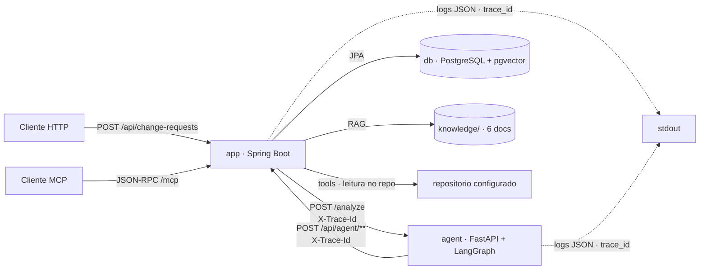

# AI Change Request Analyzer

Aplicação acadêmica que recebe uma solicitação de alteração em software e produz uma análise estruturada de impacto, risco e testes. O agente **não** altera código automaticamente.

Caminho executável de ponta a ponta: fundação (`foundation`), domínio e API (`domain-and-api`), orquestração LangGraph completa (`langgraph-orchestration`) e — nesta change — **IA, tools, RAG e memória reais** (`ai-rag-memory-tools`): prompts versionados com structured output validado, 4 tools com proteções (2 expostas via servidor MCP), RAG pgvector com fontes/scores e memória persistente de análises anteriores. Segurança/aprovação humana entram na change 05 (`docs/roadmap.md`).

## Visão geral dos componentes

| Componente | Tecnologia | Responsabilidade |
|---|---|---|
| `app` | Java 21 · Spring Boot 4.1.1 · JPA · Spring AI | Recebe `POST /api/change-requests`, gera `trace_id`, delega ao agente com timeout/retry, persiste solicitação + análise estruturada. Hospeda a camada IA (prompts versionados + structured output + retry), as 4 tools, o RAG pgvector, a memória, o servidor MCP e os endpoints internos `/api/agent/**`. |
| `agent` | Python 3.12 · FastAPI · LangGraph | Sidecar que executa o grafo LangGraph completo (13 nós) e obtém evidência real da aplicação via HTTP (`/api/agent/**`, timeout/retry, `X-Trace-Id`). |
| `db` | PostgreSQL 16 + pgvector | Persistência do domínio (tabelas `change_request`, `change_analysis`, `impact_finding`, `risk_assessment`, `test_recommendation`, `approval`) e índice vetorial `vector_store` da base de conhecimento. |
| CI | GitHub Actions | Lint (Spotless/ruff), testes e build dos dois serviços + job E2E. |

## Diagrama de arquitetura



## Grafo LangGraph (orquestração)

O agente executa um `StateGraph` completo com estado compartilhado tipado (`ChangeRequestState`), 13 nós na ordem do roadmap, paralelização real, branching por risco e condição de parada com retry limitado:

```
validate_request → classify_request → detect_untrusted_content
  → (analyze_code ‖ retrieve_knowledge ‖ retrieve_history)   [paralelo]
  → analyze_impact → assess_risk → approval_router
      ├─ HIGH ──> human_approval → generate_test_plan
      └─ LOW/MEDIUM ──> generate_test_plan
  → validate_final_result
      ├─ válido ──> finalize
      ├─ inválido (retry ≤ 2) ──> generate_test_plan
      └─ esgotado ──> finalize_error (END_WITH_ERROR)
```

- **Estado:** `trace_id`, `change_request`, `classification`, `retrieved_documents`, `code_findings`, `historical_findings`, `impact_findings`, `risk_assessment`, `security_assessment`, `test_plan`, `approval_required`, `approval_status`, `final_result`, `errors`, `iteration_count`.
- **Sem loop infinito:** `validate_final_result` limita a 1 tentativa inicial + 2 correções; esgotado, termina com status `failed` e erros estruturados.
- **Falhas contidas:** qualquer exceção de nó vira entrada em `errors` (nunca quebra o processo nem vaza segredos); a análise segue degradada.
- **Conteúdo recuperado é dado não confiável:** `detect_untrusted_content` registra eventos de segurança para instruções injetadas e elas nunca alteram risco, classificação ou fluxo.
- **Regra determinística continua no Java:** o agente sinaliza pendência (`status=pending_approval` quando HIGH); `RiskPolicy` decide e persiste a obrigatoriedade de aprovação.
- **Evidência real nas etapas:** os nós `classify_request`, `analyze_code`, `retrieve_knowledge`, `retrieve_history`, `analyze_impact`, `assess_risk` e `generate_test_plan` obtêm resultado da aplicação via `agent/tools/client.py` (httpx, timeout, retry 2, `X-Trace-Id`); falha → `errors` + coleta vazia, sem interromper o grafo. Evidência da execução no Cenário A: `docs/evidence/01-langgraph.png`.

Resposta de `POST /analyze`: `{request_id, status, result}` com `status` em `completed` | `pending_approval` | `failed` e `result` com `processed_text`, `summary`, `classification`, `risk`, `confidence`, `rationale`, `findings`, `test_plan`, `approval` e `errors` (quando houver).

## Camada IA (Spring AI)

- **Prompts versionados:** `src/main/resources/prompts/<etapa>-v1.txt` (`classification`, `impact-analysis`, `risk-analysis`, `test-generation`), carregados por `PromptRegistry` (etapa + versão); nenhum prompt de produção embutido em código.
- **Structured output validado:** `AiAnalysisService` converte a saída do LLM em records tipados (`BeanOutputConverter` + jakarta.validation), com retry limitado (máx. 2). Saída inválida é descartada — nunca persistida. Esgotado o limite → fallback determinístico marcado (`degraded=true`; risco `MEDIUM`, rationale `analysis_unavailable`).
- **Conteúdo recuperado é dado:** a evidência entra na seção delimitada `DADOS NÃO CONFIÁVEIS` do user message, nunca no system prompt.
- **Sem chave, análise segue degradada:** o `ChatClient` só existe com `ai.chat.api-key`; timeout configurável (`ai.chat.timeout-ms`); segredos nunca aparecem em logs ou respostas.

## Tools (4, executadas na JVM)

`search_code(query)`, `get_file(path)`, `search_change_history(query)`, `get_related_tests(component)` — implementadas em `tools/` como ToolCallbacks registrados no `ChatClient` (tool calling real via `ToolCallingAdvisor`).

- **Validação de entrada:** query/path/component não vazios, tamanho limitado; erro estruturado para entrada inválida.
- **Acesso restrito:** `RepoAccessPolicy` normaliza o caminho contra a raiz configurada (`tools.repo-root`); `../`, absolutos fora da raiz e vazios são rejeitados. Nenhuma tool executa shell.
- **Resiliência:** cada execução tem timeout (`tools.timeout-ms`), retry máx. 2 e logs com `trace_id` (`ResilientToolCallback`); falha após retries → erro registrado e a análise segue.
- **MCP:** servidor MCP da aplicação (Spring AI, streamable HTTP em `/mcp`) expõe `search_code` e `get_file` com os mesmos callbacks. Evidência: `docs/evidence/04-mcp.png`.

## RAG (pgvector)

- **Base de conhecimento:** `knowledge/` com 6 documentos (architecture, business-rules, discount-policy, coding-guidelines, testing-guidelines, security-policy), incluindo a regra VIP 10% do Cenário A.
- **Ingestão idempotente:** migration idempotente (`PgVectorSchemaMigration`: `CREATE EXTENSION IF NOT EXISTS vector` + tabela `vector_store` + índice HNSW) e `KnowledgeIngestionService` (chunking por seção/parágrafo + embeddings + ingestão no startup **somente se a base estiver vazia** — restart não duplica).
- **Busca com metadata:** `RagService` com top-k configurável (`ai.rag.top-k`, default 4), threshold (`ai.rag.similarity-threshold`) e resultados com `source`, `document_id`, `chunk_id` e `score`, em ordem decrescente. Falha ou base vazia → lista vazia marcada (degradada). Evidência: `docs/evidence/03-rag.png`.
- **Embeddings configuráveis por env:** sem `ai.embedding.api-key` o RAG desativa e a análise segue degradada.

## Memória persistente

`AnalysisMemoryService` busca análises anteriores por termos (ILIKE no texto da solicitação), componente afetado, regra de negócio e classificação de risco, retornando identificador e resumo ("semelhante à CR-XXX"). Falha de busca → lista vazia marcada, sem interromper a análise.

## Execução via Docker Compose

Pré-requisitos: Docker (com Compose v2) e Docker Desktop em execução.

```bash
cp .env.example .env   # opcional: ajuste valores antes de subir
docker compose up --build
```

Quando os três serviços estiverem saudáveis:

- `app`: http://localhost:8080
- `agent`: http://localhost:8000
- `db`: localhost:5432

Health checks:

```bash
curl http://localhost:8080/actuator/health
curl http://localhost:8000/health
```

### Fluxo ponta a ponta

```bash
curl -X POST http://localhost:8080/api/change-requests \
  -H "Content-Type: application/json" \
  -d '{"text":"Alterar o desconto de clientes VIP de 10% para 15%."}'
```

A resposta devolve `id`, `status` (`COMPLETED`), `traceId` e o resumo da `analysis` tipada. O mesmo `traceId` é propagado ao agente via cabeçalho `X-Trace-Id` e aparece correlacionado nos logs JSON dos dois serviços.

### Registro de análise estruturada

```bash
curl -X POST http://localhost:8080/api/change-requests/<id>/analysis \
  -H "Content-Type: application/json" \
  -d '{
    "findings": [{"component":"discount-service","description":"Desconto VIP alterado","severity":"HIGH"}],
    "riskAssessment": {"level":"HIGH","confidence":0.95,"rationale":"regra financeira"},
    "testRecommendations": [{"component":"discount-service","description":"Cobrir desconto VIP de 15%","priority":"HIGH"}]
  }'

curl http://localhost:8080/api/change-requests/<id>/analysis
```

**Regra determinística (Java, nunca no LLM):** risco `HIGH` ⇒ aprovação humana obrigatória com estado `PENDING`; confidence fora de `[0,1]` ⇒ rejeição com `invalid_confidence`.

## Variáveis de ambiente

Toda configuração é fornecida por variáveis de ambiente (referência em `.env.example`, **sem valores reais**; o `.env` real nunca é versionado).

| Variável | Padrão | Uso |
|---|---|---|
| `POSTGRES_DB` | `analyzer` | Nome do banco |
| `POSTGRES_USER` | `analyzer` | Usuário do banco |
| `POSTGRES_PASSWORD` | `change-me` | Senha do banco (trocar em produção) |
| `POSTGRES_PORT` | `5432` | Porta publicada do banco |
| `SPRING_DATASOURCE_URL` | `jdbc:postgresql://db:5432/analyzer` | JDBC URL do Spring |
| `SPRING_DATASOURCE_USERNAME` | `analyzer` | Usuário JDBC |
| `SPRING_DATASOURCE_PASSWORD` | `change-me` | Senha JDBC |
| `AGENT_URL` | `http://agent:8000` | Base URL do agente |
| `AGENT_PORT` | `8000` | Porta publicada do agente |
| `APP_URL` | `http://app:8080` | Base URL da aplicação para o sidecar (contrato `/api/agent/**`) |
| `APP_PORT` | `8080` | Porta publicada do app |
| `AI_CHAT_MODEL` | *(vazio)* | Modelo de IA (chat) |
| `AI_CHAT_API_KEY` | *(vazio)* | Chave de API do chat (sem chave, a análise segue degradada) |
| `AI_CHAT_BASE_URL` | *(vazio)* | Base URL do provedor de IA |
| `AI_EMBEDDING_MODEL` | *(vazio)* | Modelo de embeddings (RAG) |
| `AI_EMBEDDING_API_KEY` | *(vazio)* | Chave de embeddings (sem chave, o RAG fica desativado) |
| `AI_EMBEDDING_BASE_URL` | *(vazio)* | Base URL do provedor de embeddings |
| `AI_RAG_ENABLED` | `true` | Habilita o RAG |
| `AI_RAG_TOP_K` | `4` | Número máximo de chunks retornados |
| `AI_RAG_SIMILARITY_THRESHOLD` | `0.7` | Score mínimo de similaridade |
| `AI_RAG_KNOWLEDGE_PATH` | `/repo/knowledge` | Diretório dos documentos de conhecimento |
| `TOOLS_REPO_ROOT` | `/repo` | Raiz do repositório acessível pelas tools (proteção contra path traversal) |

## Endpoints

| Serviço | Método | Rota | Descrição |
|---|---|---|---|
| `app` | POST | `/api/change-requests` | Cria e analisa uma solicitação de alteração |
| `app` | GET | `/api/change-requests/{id}` | Consulta status e resumo da análise de uma solicitação |
| `app` | POST | `/api/change-requests/{id}/analysis` | Registra análise estruturada (achados, risco, recomendações de teste) |
| `app` | GET | `/api/change-requests/{id}/analysis` | Consulta a análise completa tipada |
| `app` | GET | `/actuator/health` | Health check |
| `app` | POST | `/api/agent/classify` | Classificação da solicitação (IA/fallback marcado) |
| `app` | POST | `/api/agent/analyze-code` | Evidência de código e testes via tools |
| `app` | POST | `/api/agent/retrieve-knowledge` | Busca RAG com fontes e scores |
| `app` | POST | `/api/agent/retrieve-history` | Memória: análises anteriores |
| `app` | POST | `/api/agent/analyze-impact` | Achados de impacto (IA sobre evidências) |
| `app` | POST | `/api/agent/assess-risk` | Sugestão de risco (IA; regra final no Java) |
| `app` | POST | `/api/agent/generate-test-plan` | Recomendações de testes (IA/fallback marcado) |
| `app` | POST | `/mcp` | Servidor MCP (JSON-RPC streamable HTTP): `search_code`, `get_file` |
| `agent` | POST | `/analyze` | Executa o grafo de análise (corpo `{request_id, text}`) |
| `agent` | GET | `/health` | Health check |

## Observabilidade

- `app`: gera um UUID por requisição no `TraceIdFilter`, coloca em MDC e propaga via `X-Trace-Id`; logs JSON via `logstash-logback-encoder`.
- `agent`: structlog em JSON usando o `trace_id` do cabeçalho (gera um próprio se ausente).
- Os dois sinais de observabilidade correlacionam-se pelo mesmo `trace_id`.

## Testes e CI

- Java: `./mvnw test` (117 testes — happy path, segurança/path traversal, structured output com ChatModel fake, RAG com VectorStore mockado, memória com H2, MCP, controller `/api/agent`) e `./mvnw spotless:check`. Suíte inteira verde **sem chave de API**.
- Python (em `agent/`): `pytest` e `ruff check .` — cobre o grafo nos 6 cenários do roadmap (happy path, high risk, prompt injection, tool failure, validation failure, max iteration), aplicação indisponível, paralelismo e propagação de trace_id, com client HTTP mockado.
- E2E: `docker compose up --build` + `python scripts/smoke_test.py` — Cenário A (desconto VIP 10%→15%) com chave configurada, ou fluxo degradado marcado (`analysis_unavailable`) sem chave; `trace_id` correlacionado nos logs dos dois serviços.
- Demonstrações: `scripts/rag_demo.py` (RAG com fontes/scores), `scripts/mcp_tools_demo.py` (MCP tools/list + proteção de path), `scripts/fake_embeddings_server.py` (embeddings determinísticos locais só para demonstração).
- CI: `.github/workflows/ci.yml` (jobs `spring`, `agent` e `e2e`).
