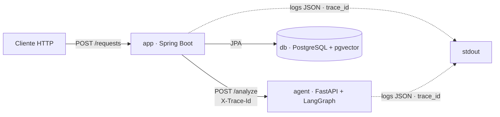

# AI Change Request Analyzer

Aplicação acadêmica que recebe uma solicitação de alteração em software e produz uma análise estruturada de impacto, risco e testes. O agente **não** altera código automaticamente.

Esta é a change de fundação (`foundation`): um caminho executável de ponta a ponta com observabilidade (trace_id + logs JSON) e CI verde, sem chamadas a LLM — o modelo de IA, RAG, MCP e aprovação humana entram nas próximas changes do roadmap (`docs/roadmap.md`).

## Visão geral dos componentes

| Componente | Tecnologia | Responsabilidade |
|---|---|---|
| `app` | Java 21 · Spring Boot 4.1.1 · JPA | Recebe `POST /requests`, gera `trace_id`, delega ao agente com timeout/retry, persiste status/resultado e expõe `GET /requests/{id}`. |
| `agent` | Python 3.12 · FastAPI · LangGraph | Sidecar que executa um grafo LangGraph mínimo (`START → parse_stub → compile_stub → END`) e responde `POST /analyze` / `GET /health`. |
| `db` | PostgreSQL 16 + pgvector | Persistência do domínio (tabela `change_request`). |
| CI | GitHub Actions | Lint (Spotless/ruff), testes e build dos dois serviços + job E2E. |

## Diagrama de arquitetura



## Execução via Docker Compose

Pré-requisitos: Docker (com Compose v2) e Docker Desktop em execução.

```bash
cp .env.example .env   # opcional: ajuste valores antes de subir
docker compose up --build
```

Quando os três serviços estiverem saudáveis:

- `app`: http://localhost:8080
- `agent`: http://localhost:8000
- `db`: localhost:5432

Health checks:

```bash
curl http://localhost:8080/actuator/health
curl http://localhost:8000/health
```

### Fluxo ponta a ponta

```bash
curl -X POST http://localhost:8080/requests \
  -H "Content-Type: application/json" \
  -d '{"text":"Alterar o desconto de clientes VIP de 10% para 15%."}'
```

A resposta devolve `id`, `status` (`COMPLETED`), `traceId` e `result` estruturado. O mesmo `traceId` é propagado ao agente via cabeçalho `X-Trace-Id` e aparece correlacionado nos logs JSON dos dois serviços.

## Variáveis de ambiente

Toda configuração é fornecida por variáveis de ambiente (referência em `.env.example`, **sem valores reais**; o `.env` real nunca é versionado).

| Variável | Padrão | Uso |
|---|---|---|
| `POSTGRES_DB` | `analyzer` | Nome do banco |
| `POSTGRES_USER` | `analyzer` | Usuário do banco |
| `POSTGRES_PASSWORD` | `change-me` | Senha do banco (trocar em produção) |
| `POSTGRES_PORT` | `5432` | Porta publicada do banco |
| `SPRING_DATASOURCE_URL` | `jdbc:postgresql://db:5432/analyzer` | JDBC URL do Spring |
| `SPRING_DATASOURCE_USERNAME` | `analyzer` | Usuário JDBC |
| `SPRING_DATASOURCE_PASSWORD` | `change-me` | Senha JDBC |
| `AGENT_URL` | `http://agent:8000` | Base URL do agente |
| `APP_PORT` | `8080` | Porta publicada do app |
| `AGENT_PORT` | `8000` | Porta publicada do agente |
| `AI_CHAT_MODEL` | *(vazio)* | Modelo de IA (esqueleto Spring AI) |
| `AI_CHAT_API_KEY` | *(vazio)* | Chave de API (não obrigatória para subir) |
| `AI_CHAT_BASE_URL` | *(vazio)* | Base URL do provedor de IA |

## Endpoints

| Serviço | Método | Rota | Descrição |
|---|---|---|---|
| `app` | POST | `/requests` | Cria e analisa uma solicitação de alteração |
| `app` | GET | `/requests/{id}` | Consulta status e resultado de uma solicitação |
| `app` | GET | `/actuator/health` | Health check |
| `agent` | POST | `/analyze` | Executa o grafo de análise (corpo `{request_id, text}`) |
| `agent` | GET | `/health` | Health check |

## Observabilidade

- `app`: gera um UUID por requisição no `TraceIdFilter`, coloca em MDC e propaga via `X-Trace-Id`; logs JSON via `logstash-logback-encoder`.
- `agent`: structlog em JSON usando o `trace_id` do cabeçalho (gera um próprio se ausente).
- Os dois sinais de observabilidade correlacionam-se pelo mesmo `trace_id`.

## Testes e CI

- Java: `./mvnw test` e `./mvnw spotless:check`.
- Python (em `agent/`): `pytest` e `ruff check .`.
- CI: `.github/workflows/ci.yml` (jobs `spring`, `agent` e `e2e`).
