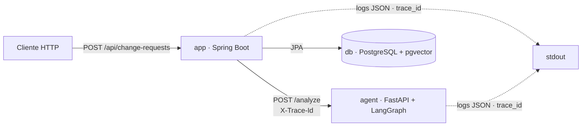

# AI Change Request Analyzer

Aplicação acadêmica que recebe uma solicitação de alteração em software e produz uma análise estruturada de impacto, risco e testes. O agente **não** altera código automaticamente.

Esta é a change de fundação (`foundation`) + domínio e API (`domain-and-api`) + orquestração LangGraph completa (`langgraph-orchestration`): um caminho executável de ponta a ponta com observabilidade (trace_id + logs JSON), modelo de domínio tipado com regras determinísticas, grafo LangGraph de 13 nós (paralelização, branching e condição de parada) e CI verde. O modelo de IA, RAG, MCP e aprovação humana entram nas próximas changes do roadmap (`docs/roadmap.md`).

## Visão geral dos componentes

| Componente | Tecnologia | Responsabilidade |
|---|---|---|
| `app` | Java 21 · Spring Boot 4.1.1 · JPA | Recebe `POST /api/change-requests`, gera `trace_id`, delega ao agente com timeout/retry, persiste solicitação + análise estruturada e expõe os endpoints de consulta. |
| `agent` | Python 3.12 · FastAPI · LangGraph | Sidecar que executa o grafo LangGraph completo (13 nós com paralelização, branching e condição de parada) e responde `POST /analyze` / `GET /health`. |
| `db` | PostgreSQL 16 + pgvector | Persistência do domínio (tabelas `change_request`, `change_analysis`, `impact_finding`, `risk_assessment`, `test_recommendation`, `approval`). |
| CI | GitHub Actions | Lint (Spotless/ruff), testes e build dos dois serviços + job E2E. |

## Diagrama de arquitetura



## Grafo LangGraph (orquestração)

O agente executa um `StateGraph` completo com estado compartilhado tipado (`ChangeRequestState`), 13 nós na ordem do roadmap, paralelização real, branching por risco e condição de parada com retry limitado:

```
validate_request → classify_request → detect_untrusted_content
  → (analyze_code ‖ retrieve_knowledge ‖ retrieve_history)   [paralelo]
  → analyze_impact → assess_risk → approval_router
      ├─ HIGH ──> human_approval → generate_test_plan
      └─ LOW/MEDIUM ──> generate_test_plan
  → validate_final_result
      ├─ válido ──> finalize
      ├─ inválido (retry ≤ 2) ──> generate_test_plan
      └─ esgotado ──> finalize_error (END_WITH_ERROR)
```

- **Estado:** `trace_id`, `change_request`, `classification`, `retrieved_documents`, `code_findings`, `historical_findings`, `impact_findings`, `risk_assessment`, `security_assessment`, `test_plan`, `approval_required`, `approval_status`, `final_result`, `errors`, `iteration_count`.
- **Sem loop infinito:** `validate_final_result` limita a 1 tentativa inicial + 2 correções; esgotado, termina com status `failed` e erros estruturados.
- **Falhas contidas:** qualquer exceção de nó vira entrada em `errors` (nunca quebra o processo nem vaza segredos); a análise segue degradada.
- **Conteúdo recuperado é dado não confiável:** `detect_untrusted_content` registra eventos de segurança para instruções injetadas e elas nunca alteram risco, classificação ou fluxo.
- **Regra determinística continua no Java:** o agente sinaliza pendência (`status=pending_approval` quando HIGH); `RiskPolicy` decide e persiste a obrigatoriedade de aprovação.
- Nesta change os nós são stubs determinísticos (LLM, RAG e tools reais entram na change 04). Evidência da execução no Cenário A: `docs/evidence/01-langgraph.png`.

Resposta de `POST /analyze`: `{request_id, status, result}` com `status` em `completed` | `pending_approval` | `failed` e `result` com `processed_text`, `summary`, `classification`, `risk`, `confidence`, `rationale`, `findings`, `test_plan`, `approval` e `errors` (quando houver).

## Execução via Docker Compose

Pré-requisitos: Docker (com Compose v2) e Docker Desktop em execução.

```bash
cp .env.example .env   # opcional: ajuste valores antes de subir
docker compose up --build
```

Quando os três serviços estiverem saudáveis:

- `app`: http://localhost:8080
- `agent`: http://localhost:8000
- `db`: localhost:5432

Health checks:

```bash
curl http://localhost:8080/actuator/health
curl http://localhost:8000/health
```

### Fluxo ponta a ponta

```bash
curl -X POST http://localhost:8080/api/change-requests \
  -H "Content-Type: application/json" \
  -d '{"text":"Alterar o desconto de clientes VIP de 10% para 15%."}'
```

A resposta devolve `id`, `status` (`COMPLETED`), `traceId` e o resumo da `analysis` tipada. O mesmo `traceId` é propagado ao agente via cabeçalho `X-Trace-Id` e aparece correlacionado nos logs JSON dos dois serviços.

### Registro de análise estruturada

```bash
curl -X POST http://localhost:8080/api/change-requests/<id>/analysis \
  -H "Content-Type: application/json" \
  -d '{
    "findings": [{"component":"discount-service","description":"Desconto VIP alterado","severity":"HIGH"}],
    "riskAssessment": {"level":"HIGH","confidence":0.95,"rationale":"regra financeira"},
    "testRecommendations": [{"component":"discount-service","description":"Cobrir desconto VIP de 15%","priority":"HIGH"}]
  }'

curl http://localhost:8080/api/change-requests/<id>/analysis
```

**Regra determinística (Java, nunca no LLM):** risco `HIGH` ⇒ aprovação humana obrigatória com estado `PENDING`; confidence fora de `[0,1]` ⇒ rejeição com `invalid_confidence`.

## Variáveis de ambiente

Toda configuração é fornecida por variáveis de ambiente (referência em `.env.example`, **sem valores reais**; o `.env` real nunca é versionado).

| Variável | Padrão | Uso |
|---|---|---|
| `POSTGRES_DB` | `analyzer` | Nome do banco |
| `POSTGRES_USER` | `analyzer` | Usuário do banco |
| `POSTGRES_PASSWORD` | `change-me` | Senha do banco (trocar em produção) |
| `POSTGRES_PORT` | `5432` | Porta publicada do banco |
| `SPRING_DATASOURCE_URL` | `jdbc:postgresql://db:5432/analyzer` | JDBC URL do Spring |
| `SPRING_DATASOURCE_USERNAME` | `analyzer` | Usuário JDBC |
| `SPRING_DATASOURCE_PASSWORD` | `change-me` | Senha JDBC |
| `AGENT_URL` | `http://agent:8000` | Base URL do agente |
| `APP_PORT` | `8080` | Porta publicada do app |
| `AGENT_PORT` | `8000` | Porta publicada do agente |
| `AI_CHAT_MODEL` | *(vazio)* | Modelo de IA (esqueleto Spring AI) |
| `AI_CHAT_API_KEY` | *(vazio)* | Chave de API (não obrigatória para subir) |
| `AI_CHAT_BASE_URL` | *(vazio)* | Base URL do provedor de IA |

## Endpoints

| Serviço | Método | Rota | Descrição |
|---|---|---|---|
| `app` | POST | `/api/change-requests` | Cria e analisa uma solicitação de alteração |
| `app` | GET | `/api/change-requests/{id}` | Consulta status e resumo da análise de uma solicitação |
| `app` | POST | `/api/change-requests/{id}/analysis` | Registra análise estruturada (achados, risco, recomendações de teste) |
| `app` | GET | `/api/change-requests/{id}/analysis` | Consulta a análise completa tipada |
| `app` | GET | `/actuator/health` | Health check |
| `agent` | POST | `/analyze` | Executa o grafo de análise (corpo `{request_id, text}`) |
| `agent` | GET | `/health` | Health check |

## Observabilidade

- `app`: gera um UUID por requisição no `TraceIdFilter`, coloca em MDC e propaga via `X-Trace-Id`; logs JSON via `logstash-logback-encoder`.
- `agent`: structlog em JSON usando o `trace_id` do cabeçalho (gera um próprio se ausente).
- Os dois sinais de observabilidade correlacionam-se pelo mesmo `trace_id`.

## Testes e CI

- Java: `./mvnw test` e `./mvnw spotless:check`.
- Python (em `agent/`): `pytest` e `ruff check .` — cobre o grafo nos 6 cenários do roadmap: happy path, high risk, prompt injection, tool failure, validation failure e max iteration, além de paralelismo e propagação de trace_id.
- CI: `.github/workflows/ci.yml` (jobs `spring`, `agent` e `e2e`).
